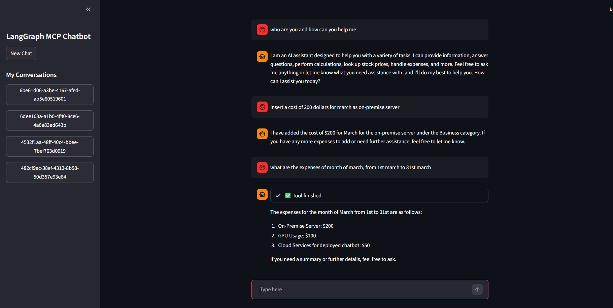

## Local & Cloud MCP Tool Server
A FastMCP-powered server providing a suite of local tools for LLMs. It features dedicated arithmetic operations (add, subtract, multiply, divide) to ensure mathematical accuracy and an Alpha Vantage integration for real-time stock price retrieval. Additionally, it includes an expense management module for tracking and categorizing local financial data.

